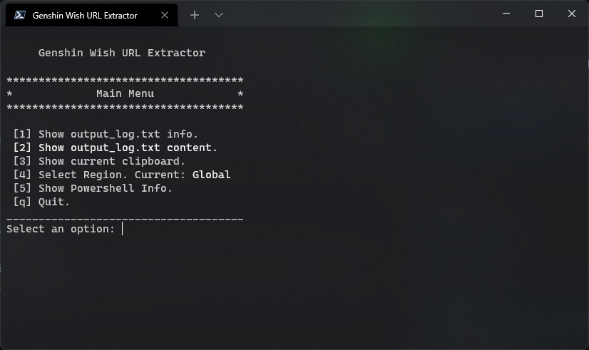

# GenshinWishUrlExtractor

I wrote this script to simplify getting getting the url in the output_log.txt which contains the link to the wishes as an alternative to the feedback url which is currently broken.

## How to use
- Go to releases and download `GenshinWishUrlExtractor.ps1`
- Right Click the file and run it with Powershell
